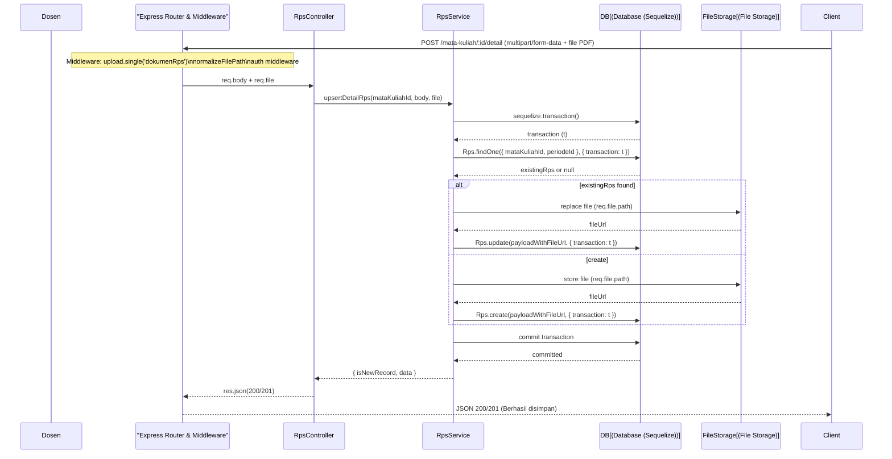
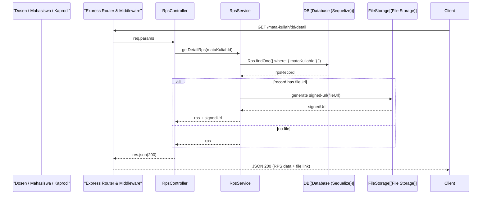
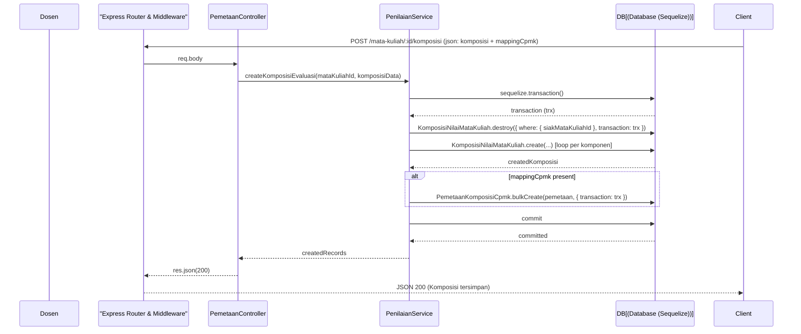
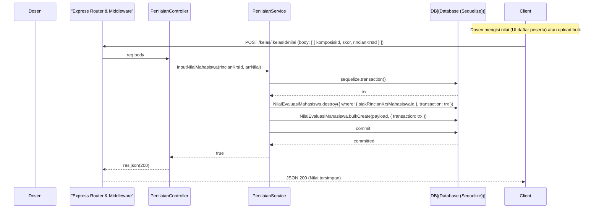
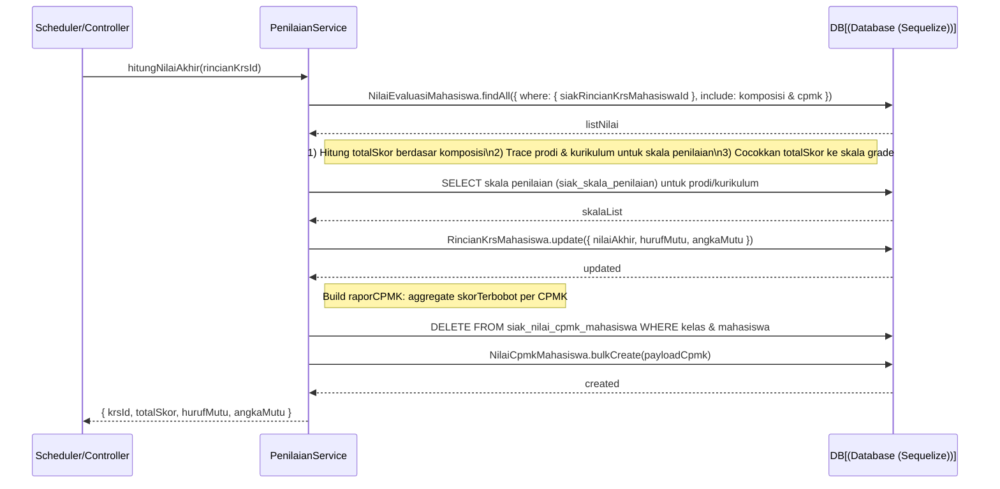
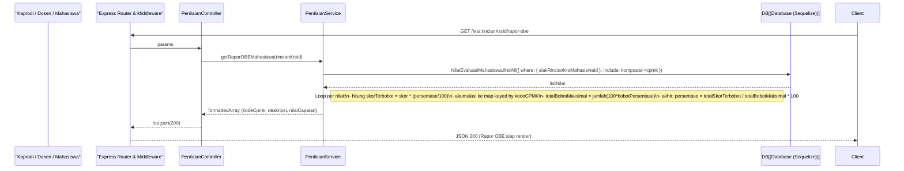
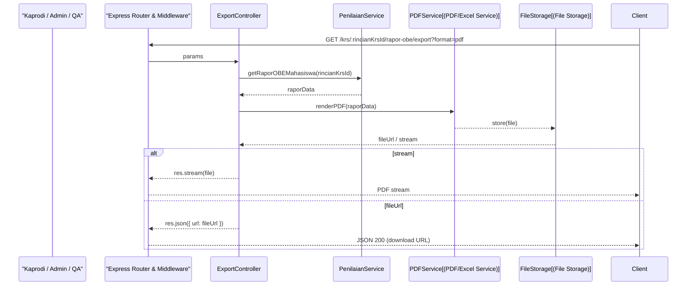
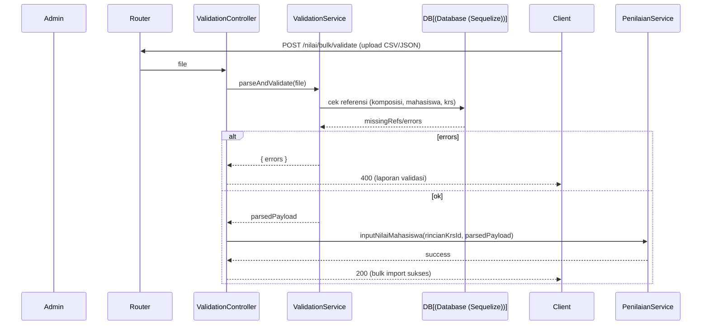
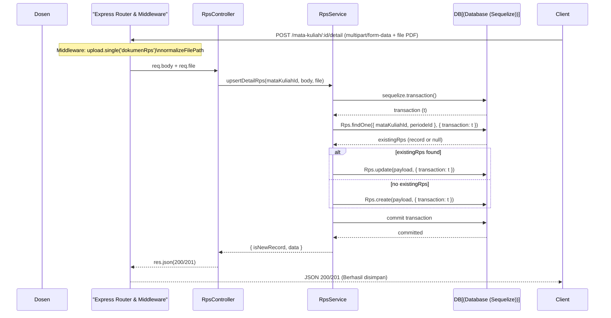
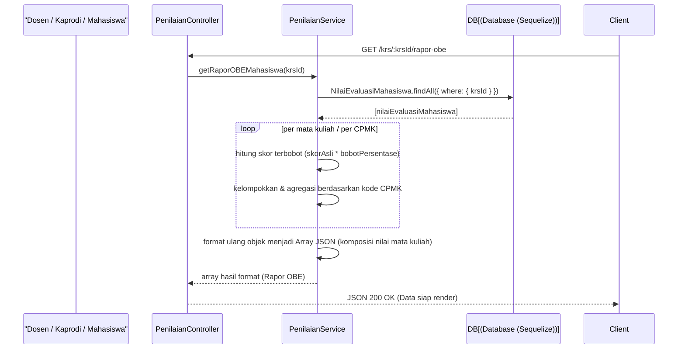

## Diagram Sequence (diperbarui untuk project)

Catatan: semua actor user diganti menjadi **Client**. Database digambarkan sebagai ikon DB (Database (Sequelize)).

Tujuan dokumen ini: menyediakan diagram sequence lengkap untuk alur OBE (Outcome-Based Education) di project.
Diagram menggunakan notation Mermaid `sequenceDiagram`. Setiap diagram menampilkan actor `Client`, layer Express (Router & Middleware), Controller, Service, dan Database (Sequelize).

---

### 1) Upload / Upsert RPS (dokumen + metadata)

---

### 2) Ambil/Render RPS (GET)

---

### 3) Setup Komposisi Evaluasi & Pemetaan CPMK (RPS → CPMK)

---

### 4) Input Nilai Evaluasi Mahasiswa (single & bulk)

---

### 5) Hitung Nilai Akhir & Simpan Nilai CPMK (hitungNilaiAkhir)

---

### 6) Generate Rapor OBE (frontend request) — `getRaporOBEMahasiswa`

---

### 7) Export / Render Rapor (PDF / Excel)

---

### 8) Alur Validasi & Bulk (contoh brevity)

---

**Referensi Kode (controller / service / model / route)**

- **Controllers**:
    - [controllers/akademik/penilaian.controller.js](controllers/akademik/penilaian.controller.js) — endpoint untuk setup komposisi RPS, input nilai, dan generate rapor.
    - [controllers/akademik/rps.controller.js](controllers/akademik/rps.controller.js) — get/save detail RPS, rencana pembelajaran, rencana evaluasi.
    - [controllers/akademik/obe.controller.js](controllers/akademik/obe.controller.js) — CPL/CPMK/Profil Lulusan dan pemetaan.
    - [controllers/akademik/export.controller.js](controllers/akademik/export.controller.js) — export PDF/Excel untuk laporan OBE dan matriks.

- **Services**:
    - [services/penilaian.service.js](services/penilaian.service.js) — `createKomposisiEvaluasi`, `inputNilaiMahasiswa`, `hitungNilaiAkhir`, `getRaporOBEMahasiswa`, `getPesertaKelasList`.
    - [services/rps.service.js](services/rps.service.js) — `upsertDetailRps`, `getFormDetailRps`, `getRencanaPembelajaran`, `saveRencanaEvaluasi`.
    - [services/obe.service.js](services/obe.service.js) — pengelolaan CPL/CPMK/profil lulusan dan helper untuk export.

- **Models (utama yang digunakan)**:
    - [models/rps.models.js](models/rps.models.js)
    - [models/komposisi-nilai-mata-kuliah.models.js](models/komposisi-nilai-mata-kuliah.models.js)
    - [models/pemetaan-komposisi-cpmk.models.js](models/pemetaan-komposisi-cpmk.models.js)
    - [models/nilai_evaluasi_mahasiswa.models.js](models/nilai_evaluasi_mahasiswa.models.js)
    - [models/nilai-cpmk-mahasiswa.models.js](models/nilai-cpmk-mahasiswa.models.js)
    - [models/rincian-krs-mahasiswa.models.js](models/rincian-krs-mahasiswa.models.js)
    - [models/krs-mahasiswa.models.js](models/krs-mahasiswa.models.js)
    - [models/skala-penilaian.models.js](models/skala-penilaian.models.js)
    - [models/capaian-mata-kuliah.models.js](models/capaian-mata-kuliah.models.js)
    - [models/index.js](models/index.js)

- **Routes**:
    - [routes/penilaian.routes.js](routes/penilaian.routes.js) — route mapping untuk setup/input/rapor.
    - [routes/akademik/rps.router.js](routes/akademik/rps.router.js) — routes RPS (detail, rencana, evaluasi).

Tautan di atas merujuk ke file di workspace; buka file yang relevan untuk melihat implementasi fungsi yang dipakai di diagram.

Jika Anda mau, saya bisa:
- Mengekspor tiap diagram ke PNG/SVG dan menaruhnya di `doc/uml/`.
- Memecah diagram menjadi gambar terpisah untuk presentasi.
- Menambahkan cross-reference langsung ke fungsi/line spesifik (beritahu file yang ingin ditautkan ke baris tertentu).

File ini: [doc/sequence_diagrams.md](doc/sequence_diagrams.md)

---

### Upload RPS (flow utama)

---

### Rapor OBE (get Rapor untuk mahasiswa)

---

Jika Anda mau, saya bisa juga:
- Mengekspor diagram ke PNG/SVG untuk dimasukkan ke dokumentasi
- Memecah diagram menjadi beberapa file gambar untuk presentasi
- Menambahkan referensi file/controller aktual dari project

File ini: [doc/sequence_diagrams.md](doc/sequence_diagrams.md)
